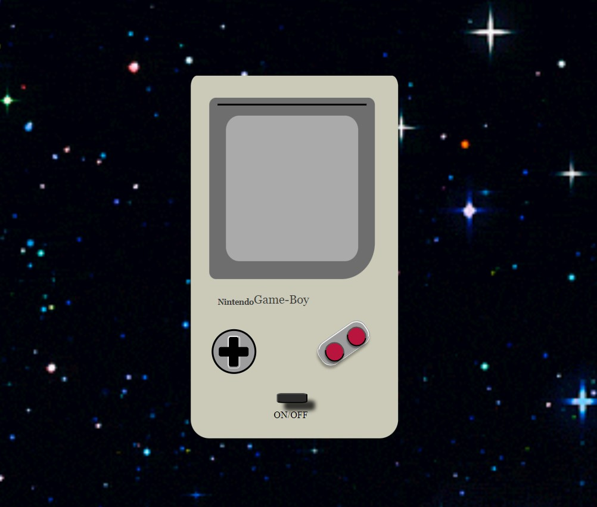
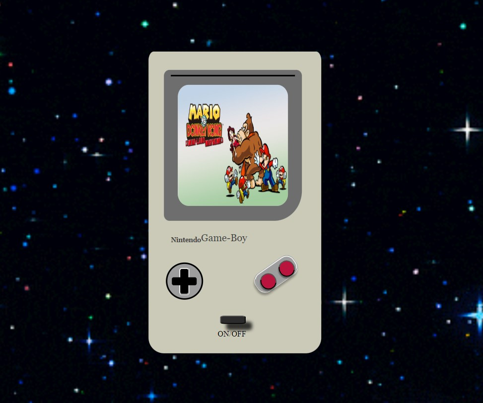
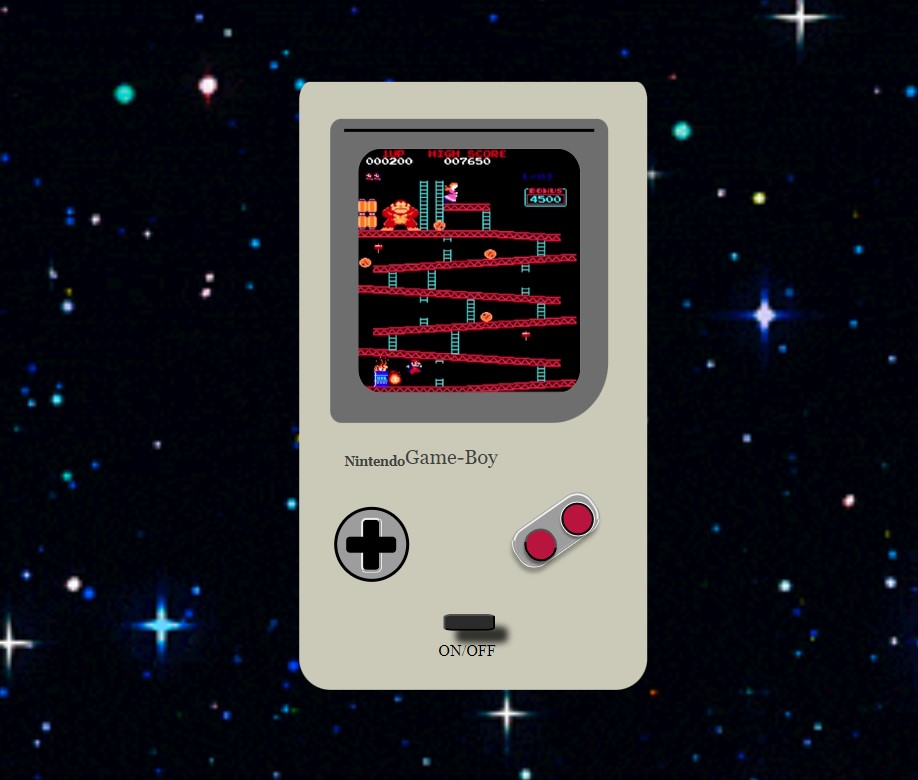
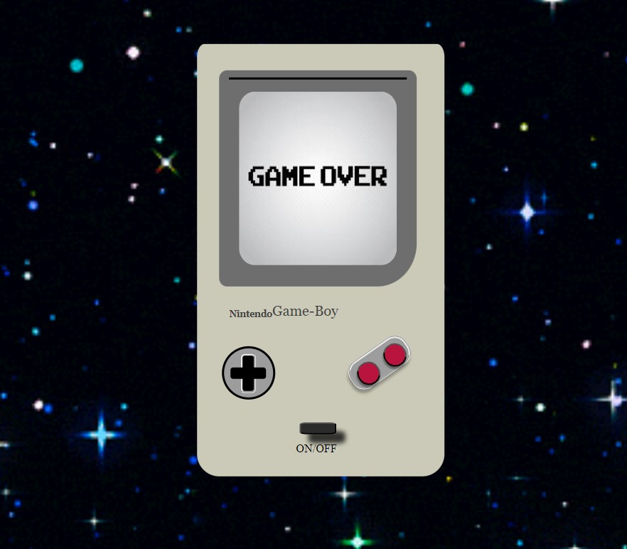
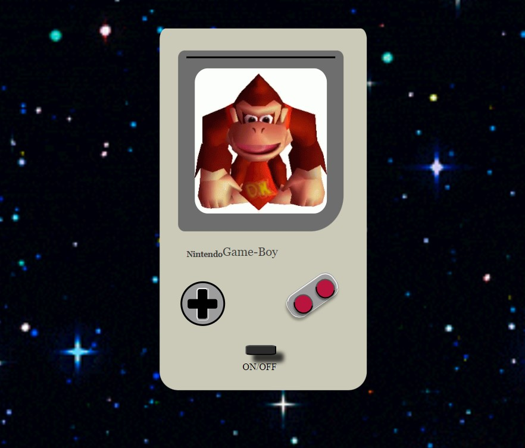

#

## NINTENDO GAME-BOY 

Proyecto n2 donde presento una consola de Nintendo Game-Boy que tiene botones donde se puede interactuar, 

Consta de tres botones interactivos:

-On/Off
-BotonA
-BotonB

## FUNCIONAMIENTO DE LA CONSOLA

![Consola] ()

Encontramos el boton que enciende y apaga el Nintendo y dos botones color rosado que muestra varias imagenes del juego.

![Encendido] ()

Al hacer clic en el boton central de la parte inferior podemos observar una imagen de juego del nintendo.

![Gif-] ()

Podemos encontrar dos botones rosados en la parte inferior derecha, el boton que encontramos a la derecha al hacer clic en el, podemos encontrar una Gif de lo que seria el juego.

![GameOver-] () 
             () 

            
Al hacer clic en otro boton rosado que se encuentra del lado izquierdo, podemos encontrar una imagen de Game Over y si le volvemos a dar clic aparecera en Gif.

## TECNOLOGIAS UTILIZADAS 

-HTML
-CSS3
-BOOTSTRAP
-JAVASCRIPT

## AUTOR 

    Yudith Brandao

## INFORMACION DE CONTACTO

    Telefono Mobil: +58 000 000
    Gmail yudi@brandao.com

## SECCION DE BUGS CONOCIDOS

    El juego puede presentar varias fallas como que los botones rosados no estan identificados... Se encuentra en reparacion...

